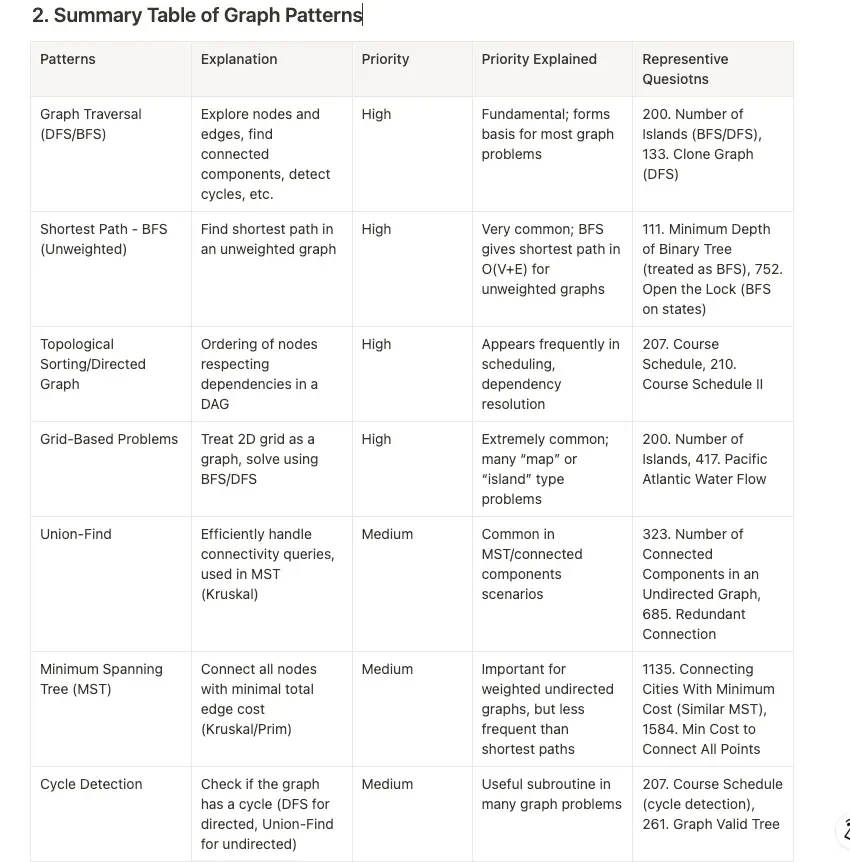
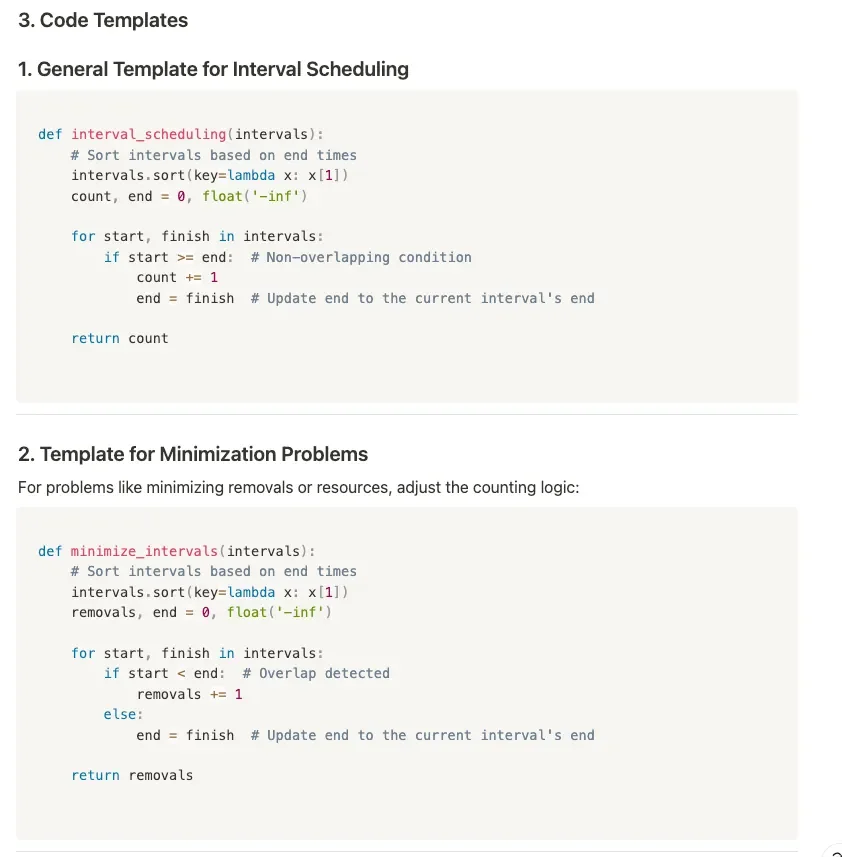

Computer Science problems in Java.

### Master List

1. Grind 75 – A curated LeetCode problem list that encompasses common interview topics: https://lnkd.in/gM_en6dQ (
   grind75.com for more)
2. NeetCode – For crystal clear explanations of LeetCode solutions: https://lnkd.in/gcKGJP3f
3. Hello Interview – AI-guided system design mock interviews (website + YouTube): https://lnkd.in/gw4k4rau
4. interviewing.io System Design Guide – Especially the first three sections, packed with fun
   analogies: https://lnkd.in/g9MKnE85
5. Exponent – A platform for peer-to-peer mock interviews: https://lnkd.in/gunUpv3y

### Topics covered

1. LinkedList
    1. Fast and Slow Pointer
        1. Midpoint of LinkedList
        2. Nth element removal from the end of the list

## Backlog

### Problems

1. Dynamic Programming: There are two strings S1 and S2. Find the length of the largest substring which contains all and
   only the characters of S2.
2. You have N cars numbered from 1 to N. Car 1 is open and all the other cars are closed. Each car has a list of keys
   where key i can open the car i. Find out if we can open all the cars.

### Patterns

1. Two Pointers
2. Sliding Window
3. Prefix Sums
4. Merge Intervals
5. Binary Search (and Variants)
6. Sorting-Based Patterns
7. Fast and Slow Pointers
8. Backtracking & Recursive Search
9. Divide and Conquer
10. Linked List Techniques (Dummy Node, In-place Reversal)
11. Stacks and Queues
12. Monotonic Stack / Queue
13. Expression Evaluation (Two Stacks)
14. String Manipulation & Regular Expressions
15. Hashmaps & Frequency Counting
16. Binary Trees & BSTs (Traversal, Construction, Properties)
17. Path Sum & Root-to-Leaf Techniques
18. Kth Largest/Smallest Elements (Heaps / QuickSelect)
19. Top K Frequent Elements
20. Merge K Sorted Lists
21. Dynamic Programming (Including Knapsack, Range DP, etc.)
22. Greedy & Interval Partitioning
23. Graph Traversals (BFS, DFS)
24. Graph Algorithms (DAGs, MSTs, Shortest Paths, etc.)
25. Design Problems (LRU Cache, Twitter, etc.)

## Question Bank

**𝗔𝗿𝗿𝗮𝘆𝘀 𝗮𝗻𝗱 𝗦𝘁𝗿𝗶𝗻𝗴𝘀:**

1. Find the maximum sum subarray.
2. Find all substrings that are palindromes.
3. Implement the "two-sum" problem.
4. Implement Kadane's algorithm for maximum subarray sum.
5. Find the missing number in an array of integers.
6. Merge two sorted arrays into one sorted array.
7. Check if a string is a palindrome.
8. Find the first non-repeating character in a string.
9. Write a program to remove duplicates from a sorted array.

**𝗟𝗶𝗻𝗸𝗲𝗱 𝗟𝗶𝘀𝘁𝘀:**

1. Reverse a linked list. ✅
2. Detect a cycle in a linked list.
3. Find the middle of a linked list. ✅
4. Merge two sorted linked lists. ✅
5. Implement a stack using linked list.
6. Find the intersection point of two linked lists.

**𝗦𝘁𝗮𝗰𝗸𝘀 𝗮𝗻𝗱 𝗤𝘂𝗲𝘂𝗲𝘀:**

1. Implement a stack using an array.
2. Implement a stack that supports push, pop, top, and retrieving the minimum element.
3. Implement a circular queue.
4. Design a max stack that supports push, pop, top, retrieve maximum element.
5. Design a queue using stacks.

**𝗧𝗿𝗲𝗲𝘀 𝗮𝗻𝗱 𝗕𝗶𝗻𝗮𝗿𝘆 𝗦𝗲𝗮𝗿𝗰𝗵 𝗧𝗿𝗲𝗲𝘀:**

1. Find the height of a binary tree.
2. Find the lowest common ancestor of two nodes in a binary tree.
3. Validate if a binary tree is a valid binary search tree.
4. Serialize and deserialize a binary tree.
5. Implement an inorder traversal of a binary tree.
6. Find the diameter of a binary tree.
7. Convert a binary tree to its mirror tree.

**𝗚𝗿𝗮𝗽𝗵𝘀:**

1. Implement depth-first search (DFS).
2. Implement breadth-first search (BFS).
3. Find the shortest path between two nodes in an unweighted graph.
4. Detect a cycle in an undirected graph using DFS.
5. Check if a graph is bipartite.
6. Find the number of connected components in an undirected graph.
7. Find bridges in a graph.

**𝗦𝗼𝗿𝘁𝗶𝗻𝗴 𝗮𝗻𝗱 𝗦𝗲𝗮𝗿𝗰𝗵𝗶𝗻𝗴:**

1. Implement (bubble, insertion, selection, merge) sort.
2. Implement quicksort.
3. Implement binary search.
4. Implement interpolation search.
5. Find the kth smallest element in an array.
6. Given an array of integers, count the number of inversions it has. An inversion occurs when two elements in the array
   are out of order.

**𝗗𝘆𝗻𝗮𝗺𝗶𝗰 𝗣𝗿𝗼𝗴𝗿𝗮𝗺𝗺𝗶𝗻𝗴 (𝗗𝗣):**

1. How do you find the nth Fibonacci number using dynamic programming?
2. Write a dynamic programming solution for the 0/1 knapsack problem.
3. Memoization to optimize recursive solutions in dynamic programming?
4. Implement a dynamic programming algorithm to find the longest common subsequence of two strings.
5. The coin change problem.
6. Tabulation approach in dynamic programming.

**𝗕𝗮𝗰𝗸𝘁𝗿𝗮𝗰𝗸𝗶𝗻𝗴:**

1. Backtracking algorithm to solve the N-Queens problem.
2. Generate all permutations of a given set using backtracking?
3. Implement backtracking to solve the Sudoku puzzle.
4. Subset sum problem.
5. Graph coloring problem using backtracking.
6. Write a backtracking algorithm to find the Hamiltonian cycle in a graph.

**𝗛𝗮𝘀𝗵𝗶𝗻𝗴:**

1. Implement a hash table using separate chaining.
2. First non-repeating character in a string using hashing.
3. Collision resolution techniques in hashing.
4. Write a function to solve the two-sum problem using hashing.
5. How can you implement a hash set data structure?
6. Count the frequency of elements in an array using hashing.

**𝗛𝗲𝗮𝗽:**

1. Implement a priority queue using a min-heap.
2. How do you merge K sorted arrays using a min-heap?
3. Write a function to perform heap sort algorithm.
4. Find the kth largest element in an array using a min-heap.
5. Implement a priority queue using a min-heap.
6. How do you build a max heap from an array?

**𝗧𝗿𝗶𝗲𝘀:**

1. Implement a trie data structure.
2. Write a function to search for a word in a trie.
3. How can you implement autocomplete feature using a trie?
4. Deleting a word from a trie.
5. Write a function to find all words matching a pattern in a trie.

**𝗚𝗿𝗲𝗲𝗱𝘆 𝗔𝗹𝗴𝗼𝗿𝗶𝘁𝗵𝗺𝘀:**

1. Solve the activity selection problem using a greedy algorithm.
2. Implement Huffman coding using a greedy algorithm.
3. Write a function to find the minimum spanning tree using Prim's algorithm.
4. Coin change problem.
5. Dijkstra's algorithm using a greedy approach.
6. Implement the job sequencing problem using a greedy algorithm.

## Problem areas

- Sliding Window and Two Pointer
- Greedy (Mostly Sorting)
- Binary Search on Answer
- All Combinations/Permutations/Ways
- K Smallest / K Largest → Heaps
- Prefix/Suffix/Word Search → Tries
- Graph - DFS / BFS
- Topological Sort
- Bitwise XOR
- Tree - DFS/BFS
- Slow and Fast Pointers - LinkedList
- Parenthesis Problems - Stack
- DP - Knapsack Problem

## Question patterns

* Arrays, Strings, Linked Lists
* Stacks, Queues, Deques
* HashMaps, HashSets
* Trees (Binary Trees, BST, Trie)
* Graphs (BFS, DFS, shortest path, cycle detection)
* Heaps / Priority Queues
* Sliding Window, Two Pointers, Backtracking
* Dynamic Programming (Tabulation, Memoization)
* Sorting & Searching (Binary Search variants)

## Question patterns

1. Fast and Slow Pointer
    - Cycle detection method
    - O(1) space efficiency
    - Linked list problems

2. Merge Intervals
    - Sort and merge
    - O(n log n) complexity
    - Overlapping interval handling

3. Sliding Window
    - Fixed/variable window
    - O(n) time optimization
    - Subarray/substring problems

4. Islands (Matrix Traversal)
    - DFS/BFS traversal
    - Connected component detection
    - 2D grid problems

5. Two Pointers
    - Dual pointer strategy
    - Linear time complexity
    - Array/list problems

6. Cyclic Sort
    - Sorting in cycles
    - O(n) time complexity
    - Constant space usage

7. In-place Reversal of Linked List
    - Reverse without extra space
    - O(n) time efficiency
    - Pointer manipulation technique

8. Breadth First Search
    - Level-by-level traversal
    - Uses queue structure
    - Shortest path problems

9. Depth First Search
    - Recursive/backtracking approach
    - Uses stack (or recursion)
    - Tree/graph traversal

10. Two Heaps
    - Max and min heaps
    - Median tracking efficiently
    - O(log n) insertions

11. Subsets
    - Generate all subsets
    - Recursive or iterative
    - Backtracking or bitmasking

12. Modified Binary Search
    - Search in variations
    - O(log n) time
    - Rotated/specialized arrays

13. Bitwise XOR
    - Toggle bits operation
    - O(1) space complexity
    - Efficient for pairing

14. Top 'K' elements
    - Use heap/quickselect
    - O(n log k) time
    - Efficient selection problem

15. K-way Merge
    - Merge sorted lists
    - Min-heap based approach
    - O(n log k) complexity

16. 0/1 Knapsack (Dynamic Programming)
    - Choose or skip items
    - O(n * W) complexity
    - Maximize value selection

17. Unbounded Knapsack (Dynamic Programming)
    - Unlimited item choices
    - O(n * W) complexity
    - Multiple item selection

18. Topological Sort (Graphs)
    - Directed acyclic graph
    - Order dependency resolution
    - Uses DFS or BFS

19. Monotonic Stack
    - Maintain increasing/decreasing stack
    - Optimized for a range queries
    - O(n) time complexity

20. Backtracking
    - Recursive decision-making
    - Explore all possibilities
    - Pruning with constraints

21. Union Find
    - Track and merge connected components
    - Used for disjoint sets
    - Great for network connectivity

22. Greedy Algorithm
    - Make locally optimal choices
    - Efficient for problems with optimal substructure
    - Covers tasks like activity selection, minimum coins

## Roadmap:

✅Build a strong foundation (WEEKS 1-4)

🎯 Focus on the most frequently used topics:

- Arrays: Prefix sum, sliding window problems.
- Strings: Two-pointer technique, pattern matching.
- Linked Lists: Reversal, cycle detection.
- Stacks/Queues: Monotonic stacks, bracket problems.

🎯 Resources:

- Neetcode 150 for a structured problem set.
- Take U Forward (YouTube): Great explanation for each video.
- GFG: Topic-wise problems with solutions.

✅Practice Problems Strategically (WEEKS 5-12)

🎯 Tackle problems in three stages:

- Stage 1: Solve 50 easy problems to get comfortable.
- Stage 2: Solve 75 medium problems, focusing on optimization.
- Stage 3: Solve 15 hard problems if targeting FAANG.

🎯 Platforms to Practice:

- LeetCode: Sort by difficulty or tags (arrays, DP). and contests
- HackerRank: For warm-ups and hiring contests.

✅ Master Core Algorithms and Data Structures (WEEKS 13–16)

🎯Key Focus Areas:

- Binary Search: Search in rotated arrays, peak elements.
- Recursion and Backtracking: Subsets, permutations, Sudoku solver.
- Dynamic Programming:
- Classic problems like Fibonacci, Knapsack, LIS.
- Understand bottom-up and top-down approaches.
- Trees and Graphs:
- BFS/DFS traversal, shortest path (Dijkstra).

🎯 Resources:

- Neetcode Playlists: Trees, DP, and Graphs.
- Tushar Roy YouTube Channel: Algorithm deep dives.
- LeetCode Discussion Forums:
  Optimized solutions and hints.

✅ Learn System Design Basics (WEEKS 17-20)

🎯 What to Focus On:

- Scalability: Load balancing, horizontal scaling.
- Caching: Strategies like LRU cache.
- Databases: SQL VS. NOSQL, partitioning, sharding.
- Design Patterns: Singleton, Observer, Factory.

🎯 Resources:

- System Design Primer (GitHub): Beginner to advanced.
- Grokking the System Design Interview: Simplified concepts.
- Designing Data-Intensive Applications: Real-world system insights.

✅ Mock Interviews and Communication (WEEKS 21-24)

🎯 What to Do:

- Pair up with peers or mentors for mock interviews.

🎯 Use platforms:

- Pramp: Peer-to-peer interviews.
- InterviewBit: Mock interviews with industry experts.
- Record yourself solving problems and analyze

✅ Behavioral Questions (ONGOING)

🎯 What to Expect:

- Questions around teamwork, challenges, and problem-solving.
- Example:
- Tell me about a time you resolved a conflict in a team.
- How do you prioritize tasks under tight deadlines?

🎯 How to Prepare:

- Use the STAR method: Situation, Task, Action, Result.
- Focus on stories that highlight leadership, impact, and learning.
- Mock practice with peers or record yourself.

🎯 Resources:

- Big Interview (Behavioral Prep):
  Comprehensive practice.
- Google common behavioral interview questions.

### SDE-3 Roadmap

𝟭. 𝗗𝗮𝘁𝗮 𝗦𝘁𝗿𝘂𝗰𝘁𝘂𝗿𝗲𝘀 𝗮𝗻𝗱 𝗔𝗹𝗴𝗼𝗿𝗶𝘁𝗵𝗺𝘀 (𝗗𝗦𝗔)

* Arrays, Strings, Linked Lists
* Stacks, Queues, Deques
* HashMaps, HashSets
* Trees (Binary Trees, BST, Trie)
* Graphs (BFS, DFS, shortest path, cycle detection)
* Heaps / Priority Queues
* Sliding Window, Two Pointers, Backtracking
* Dynamic Programming (Tabulation, Memoization)
* Sorting & Searching (Binary Search variants)

𝟮. 𝗖𝗼𝗿𝗲 𝗝𝗮𝘃𝗮 (𝗝𝗮𝘃𝗮 𝟴+)

* OOP principles
* Collections framework (List, Map, Set, Queue)
* Concurrency and Multithreading
* Java Streams and Lambda expressions
* Functional Interfaces
* Exception handling
* Memory Management, Garbage Collection
* Design Patterns (Singleton, Factory, Strategy, etc.)

𝟯. 𝗦𝗽𝗿𝗶𝗻𝗴 & 𝗕𝗮𝗰𝗸𝗲𝗻𝗱 𝗗𝗲𝘃𝗲𝗹𝗼𝗽𝗺𝗲𝗻𝘁

* Spring Core
* Spring Boot (auto-configuration, starters, profiles)
* Spring MVC (REST APIs, controllers, exception handling)
* Validation, Logging, Caching
* Unit Testing (JUnit5, Mockito)
* Spring AOP
* Swagger/OpenAPI
* REST vs SOAP, Idempotency, API versioning

𝟰. 𝗟𝗼𝘄-𝗟𝗲𝘃𝗲𝗹 𝗗𝗲𝘀𝗶𝗴𝗻 (𝗟𝗟𝗗)

* Object-oriented design principles (SOLID, DRY, YAGNI)
* Design Patterns
* Class Diagrams, Sequence Diagrams
* Design real-world systems: Parking Lot, Elevator, Splitwise, BookMyShow, etc.

𝟱. 𝗛𝗶𝗴𝗵-𝗟𝗲𝘃𝗲𝗹 𝗗𝗲𝘀𝗶𝗴𝗻 (𝗛𝗟𝗗)

* Basics of distributed systems
* Load Balancing, Caching, Database Sharding
* Microservices architecture (communication, service discovery, circuit breakers)
* Messaging Queues (Kafka, RabbitMQ)
* Scalability, Availability, CAP Theorem
* Design problems: URL shortener, Rate limiter, WhatsApp, etc.

𝟲. 𝗦𝗼𝗳𝘁 𝗦𝗸𝗶𝗹𝗹𝘀 & 𝗜𝗻𝘁𝗲𝗿𝘃𝗶𝗲𝘄 𝗣𝗿𝗲𝗽𝗮𝗿𝗮𝘁𝗶𝗼𝗻

* STAR format for behavioral questions
* Systematic problem-solving approach
* Good communication for explaining thought process

## Important and Useful Libraries

* JDK Standard Library — https://docs.oracle.com/en/java/javase/24/docs/api/index.html
* Apache Commons Lang — https://commons.apache.org/components.html
    * Lang3 Utilities — https://commons.apache.org/proper/commons-lang/javadocs/api-release/index.html
    * Collections
        * User Guide — https://commons.apache.org/proper/commons-collections/userguide.html
        * Javadoc — https://commons.apache.org/proper/commons-collections/apidocs/index.html
    * Text — https://commons.apache.org/proper/commons-text/userguide.html
    * IO — https://commons.apache.org/proper/commons-io/
    * CSV — https://commons.apache.org/proper/commons-csv/apidocs/index.html
    * Configuration — https://commons.apache.org/proper/commons-configuration/userguide/user_guide.html
    * Math — https://commons.apache.org/proper/commons-math/userguide/index.html
    * Numbers — https://commons.apache.org/proper/commons-numbers/userguide/index.html
    * Statistics — https://commons.apache.org/proper/commons-math/userguide/stat.html
    * Geometry — https://commons.apache.org/proper/commons-geometry/userguide/index.html
* Java
  Datafaker — https://s01.oss.sonatype.org/service/local/repositories/releases/archive/net/datafaker/datafaker/2.4.2/datafaker-2.4.2-javadoc.jar/!/index.html
* Guava: Google Core Libraries — https://guava.dev/releases/snapshot-jre/api/docs/
* Agrona: High-Performance data structures and utility methods for Java — https://github.com/aeron-io/agrona
* Eclipse Collections is a collections framework for Java with optimized data structures and a rich, functional, and
  fluent API. — https://github.com/eclipse-collections/eclipse-collections
* Batch framework for Java — https://github.com/j-easy/easy-batch
* Object-functional extension for Java — https://github.com/vavr-io/vavr
* Java binary serialization and cloning — https://github.com/EsotericSoftware/kryo

### Design

1. LLD of chess

### System Design Problems

#### Basics

1. Design a chess game
2. Design a simple URL shortening service.
3. Design a basic chat application.
4. Design a file storage system.
5. Design a simple social media platform.
6. Design a simple search engine.
7. Design a simple e-commerce website.
8. Design a basic ride-sharing system.
9. Design a basic video streaming service.
10. Design a simple recommendation system.
11. Design a basic food delivery app.
12. Design a parking lot management system.
13. Design a simple music streaming service.
14. Design a basic online ticket booking system.
15. Design a simple note-taking application.
16. Design a weather forecasting system.
17. Design a basic email service.
18. Design a file synchronization system.
19. Design a simple calendar application.
20. Design a basic online quiz platform.
21. Design a user authentication system.

#### Advanced

1. Design a URL-shortening service like bit.ly.
2. Design a distributed key-value store like Redis.
3. Design a scalable social network like Facebook.
4. Design a scalable recommendation system like Netflix.
5. Design a distributed file system like Hadoop's HDFS.
6. Design a real-time messaging system like WhatsApp.
7. Design a web crawler like Google.
8. Design a distributed cache like Memcached.
9. Design a content delivery network (CDN) like Cloudflare.
10. Design a scalable search engine like Google.
11. Design a ride-sharing system like Uber.
12. Design a video streaming service like YouTube.
13. Design an online food delivery system like Zomato.
14. Design a collaborative document editing system like Google Docs.
15. Design an e-commerce platform like Amazon.
16. Design a recommendation system for an online marketplace.
17. Design a fault-tolerant distributed database system.
18. Design a scalable event-driven system like Twitter.
19. Design a scalable photo-sharing platform like Instagram.
20. Design a distributed task scheduling system.

### Design Patterns

#### Creational patterns

These patterns provide various object creation mechanisms, which increase the flexibility and reuse of existing code.

1. Factory Method
2. Abstract Factory
3. Builder
4. Prototype
5. Singleton

#### Structural patterns

These patterns explain how to assemble objects and classes into larger structures while keeping these structures
flexible and efficient.

1. Adapter
2. Bridge
3. Composite
4. Decorator
5. Facade
6. Flyweight
7. Proxy

#### Behavioral patterns

These patterns are concerned with algorithms and the assignment of responsibilities between objects.

1. Chain of Responsibility
2. Command
3. Iterator
4. Mediator
5. Memento
6. Observer


## AI Workflow

Model: GPT-4o, o3-mini-high

### Summarize Topics, Patterns & Similar Questions
```
Please explain LeetCode question [ID], including its solution and complexity. Also, specify which topics and patterns it belongs to and suggest similar questions.

Please show a Step-by-Step Walkthrough with this example input: 
{Your example input}

You should show the value of each variable in each step and summarized it as a table.
```

### Make Minimal Changes to Fix Your Broken Solution (If you can brainstorm a whiteboard and write a solution)

Do not attempt solutions for hard problems right away — too much time will be spent.
Brainstorm solvable problems. 

Template to ask if failed:
```
Here is my solution to LeetCode question {ID}, but it doesn't pass all test cases.
Please modify the minimal number of lines to make it work and explain why.

{Your solution}

Below are the test cases it failed:

{Failed test cases}.
```

### Step-by-Step Code Execution & Explanation
Execute the code on a test case data and explain each execution step by step.

```
Please show a Step-by-Step Walkthrough with this example input: 
{Your example input}

You should show the value of each variable in each step and summarized it as a table.
```


### Learn About Topics and Patterns

```
The next topic is {topic_name}. please tell me about the 

1. core ideas and the keys(or steps) to solve this kinds of Leetcode problem
2. please summarize and create a table including
    1. Category: the type of Leetcode problem
    2. Description: explain the pattern
    3. Priority: high, medium, or low based on whether it’s important for interview preparation
    4. Why: explain the reason for the priority
    5. Representative questions: 2 or 3 representative questions

```

### Specific Pattern

```
Let’s talk about the pattern of {PATTERN} from the topic of the {TOPIC},  Based on the questions you recommended, compare and explain 2 or 3 questions to help me

1. Understand this pattern well
2. Easier to identify these pattern
3. Understand the templates to solve these problems

Please give me the following output

1. The basic idea of this pattern and how to identify this pattern
2. a summary table comparing representative leetcode question
3. code templates and their counterpart leetcode questions (at least two questions)
4. then go to the details of each question. While explaining each question, please
    1. give all details about the question description
    2. in terms of solution, focus on the goal to learn the pattern, ignore details that are too specific
```

Example:



### Compare Similar Questions and Summarize Code Templates

For example:



### OpenAI API

```
 template = """Please explain the LeetCode question: {question_title}.

    Your output should include the following headers:
    - **Problem Description**
        - Input & Output
        - Examples
    - **Topics and Patterns**
    - **Solution & Complexity**
        - Key Ideas
        - **Java Solution**
            - Code
            - Explanation
            - Step-by-Step Walkthrough (summarized as a table)
        - Detailed Complexity Analysis
    - **Similar Questions** (including question title, difficulty, description, and why it is similar—organized in a table)

    (Please avoid opening and closing remarks; the more detailed, the better.)"""
```

## Learning DSA

TRICK TO LEARN DSA FASTER!!!
As promised, here is a post on DSA prep.
As mentioned before, follow neetcode.io for intuition building and category by category prep. He became famous organically due to how good he is with whiteboarding. This is not sponsored( I am not a creator )
Now I can ask you to grind day and night, but like every exam, DSA has tricks to build intuition faster like CAT or JEE:
Base rules of DSA and human psychology:
1. Never jump from category to category and solve random problems - your brain will never form a pattern in chaos.
2. Never ever attempt the first problem on your own from any given category - just knowing how linked list works is not enough data for your mind to solve a tricky linked list problem, just like how knowing permutation formula is not enough to solve a HOTs permutation problem from NCERT. You will jeopardize your confidence and have no interest further to learn.
Best practice/trick:
Step 1: Let us go to any given category, say Graphs. DO NOT attempt the first problem on your own. Watch neetcode solve first 5 or 6 questions till your mind has a grasp of what graph based problems and solutions look like. Observation before jumping into it is key.
Step 2: Now that your mind has gotten a feel of the pattern, come to 7th question for example and just attempt the approach. DO NOT CODE. verify if your intuition aligns with neetcode. Do that for next few problems till you feel somewhat confident that you are able to do it.
Step 3: Rewrite all the 10 problems you have watched videos of so far, yourself, since you know the solutions already.
Step 4: once you are done with previous 3 steps, go to problem number 11 and attempt this completely on your own, from intuition to code and verify. You will make some mistakes but that is ok, you are close, keep going! Keep doing this for every category till you feel confident in each of them.
Step 5: Great! you feel like you can do this! revise all the problems you have done in all categories.
Step 6: Start solving one completely new problem per day to see if you are able to put it in a category and then find the right solution. Do this till you feel somewhat confident to give interviews.
This method is a lot faster than the traditional "Work hard till you figure it out" method. Also, not to mention, the number of problems a person needs to build pattern varies from person to person, so the numbers I have mentioned are averge numbers.
Try this for atleast one category and let me know how it works out in DMs! Works best on following categories: Graphs, Trees, Heaps, Tries, Intervals, Stacks, Sliding window, Linked list. Rest of them need more number of problems and practice.
